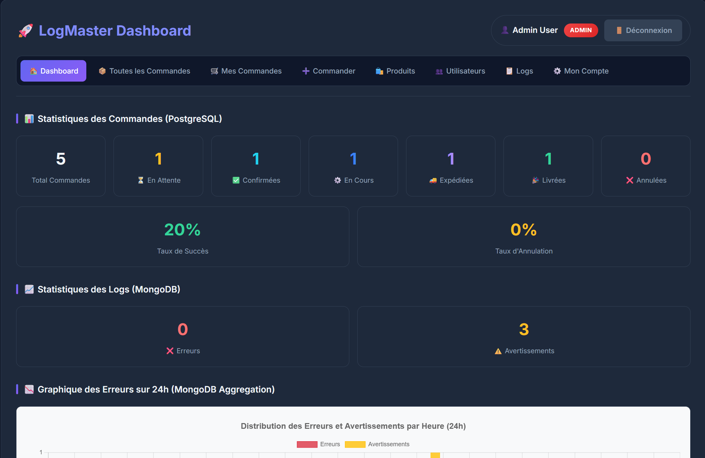
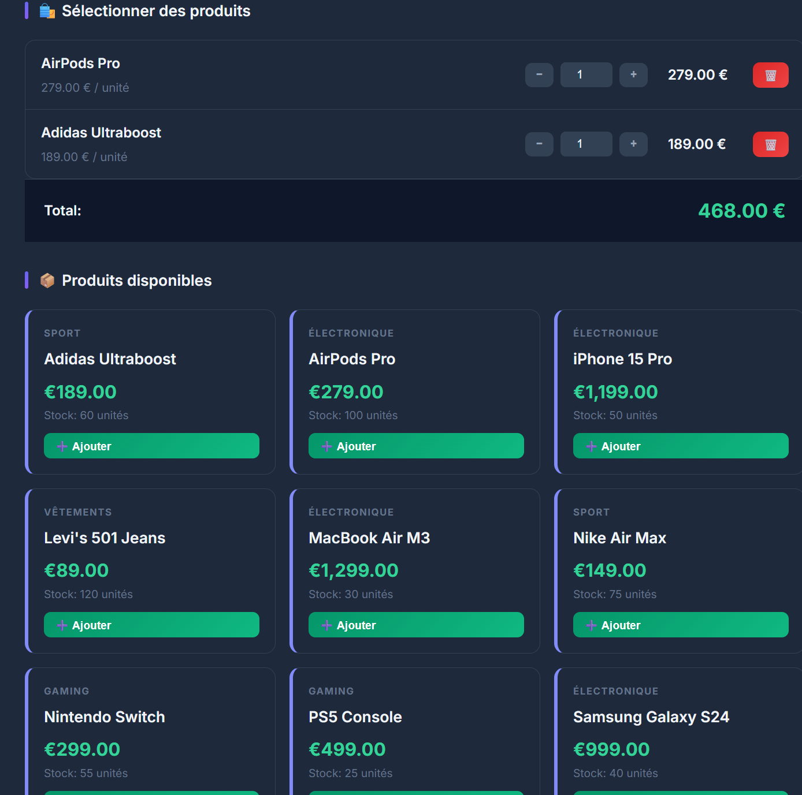
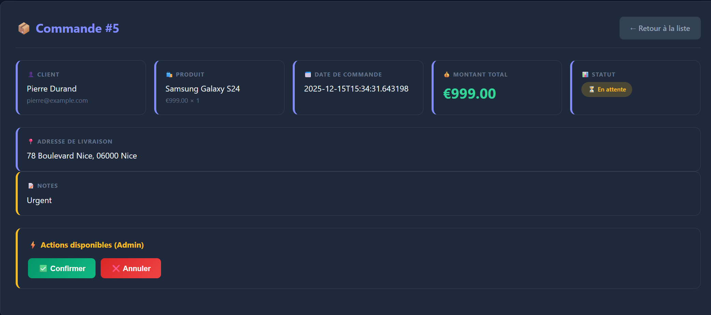

# 🚀 LogMaster - Order Management System

A full-stack Java EE web application for order management with real-time logging capabilities, built with **WildFly**, **PostgreSQL**, and **MongoDB**.


## 🎬 Demo


---

## 📋 Table of Contents

- [Features](#-features)
- [Tech Stack](#-tech-stack)
- [Prerequisites](#-prerequisites)
- [Installation](#-installation)
- [Running the Application](#-running-the-application)
- [Project Structure](#-project-structure)
- [API Endpoints](#-api-endpoints)
- [Screenshots](#-screenshots)

---

## ✨ Features

### 🔐 Authentication & Authorization
- Session-based authentication
- Role-Based Access Control (RBAC): **ADMIN** and **USER** roles
- User registration and login

### 📦 Order Management
- Multi-product shopping cart
- Real-time order tracking with 6 statuses: `PENDING`, `CONFIRMED`, `PROCESSING`, `SHIPPED`, `DELIVERED`, `CANCELLED`
- Order history per user

### 🛍️ Product Management
- Product catalog with categories
- Stock management
- Admin-only CRUD operations

### 👥 User Management
- Admin can view and manage all users
- Users can update their own profile

### 📊 Dashboard & Analytics
- Order statistics by status
- Success/cancellation rates
- MongoDB aggregation for:
  - Error/warning log counts
  - Top 5 active users
  - Event distribution charts
  - 24-hour error timeline

### 🔔 Real-Time Features
- WebSocket notifications for new orders
- Live dashboard updates

### 🌙 Modern UI
- Dark mode theme
- Responsive design
- Animated components

---

## 🛠️ Tech Stack

| Layer | Technology |
|-------|------------|
| **Backend** | Java 21, Jakarta EE 10, CDI, JPA (Hibernate) |
| **Frontend** | JSP, JSTL, CSS3, JavaScript, Chart.js |
| **App Server** | WildFly 37 |
| **Database (SQL)** | PostgreSQL 16 |
| **Database (NoSQL)** | MongoDB 7.0 |
| **Build Tool** | Maven |
| **Real-Time** | Jakarta WebSocket |

---

## 📌 Prerequisites

Before you begin, ensure you have the following installed:

1. **Java JDK 21**
   ```bash
   java -version  # Should show 21.x
   ```

2. **Maven 3.9+**
   ```bash
   mvn -version
   ```

3. **PostgreSQL 16**
   - Download: https://www.postgresql.org/download/

4. **MongoDB 7.0**
   - Download: https://www.mongodb.com/try/download/community

5. **WildFly 37**
   - Download: https://www.wildfly.org/downloads/

---

## 🚀 Installation

### 1. Clone the Repository
```bash
git clone https://github.com/YOUR_USERNAME/logmaster.git
cd logmaster
```

### 2. Setup PostgreSQL Database
```bash
# Connect to PostgreSQL
psql -U postgres

# Create database and user
CREATE DATABASE logmaster_db;
CREATE USER logmaster_user WITH PASSWORD 'password123';
GRANT ALL PRIVILEGES ON DATABASE logmaster_db TO logmaster_user;
\c logmaster_db
GRANT ALL ON SCHEMA public TO logmaster_user;
\q

# Run schema script
psql -U logmaster_user -d logmaster_db -f schema.sql
```

### 3. Start MongoDB
```bash
# Windows
mongod

# Or using MongoDB Compass, connect to localhost:27017
```

### 4. Configure WildFly

Add PostgreSQL driver to WildFly:
```bash
# Copy driver to deployments folder
copy postgresql-42.6.0.jar %WILDFLY_HOME%\standalone\deployments\
```

### 5. Build the Application
```bash
mvn clean package
```

---

## ▶️ Running the Application

### 1. Start WildFly
```bash
cd %WILDFLY_HOME%\bin
standalone.bat
```

### 2. Deploy the Application
```bash
copy target\logmaster.war %WILDFLY_HOME%\standalone\deployments\
```

### 3. Access the Application
Open your browser and navigate to:
```
http://localhost:8080/logmaster
```

### Default Credentials

| Role | Email | Password |
|------|-------|----------|
| Admin | admin@example.com | admin123 |
| User | jean@example.com | password123 |

---

## 📁 Project Structure

```
logmaster/
├── src/main/java/com/logmaster/
│   ├── api/                    # REST API Resources
│   │   ├── OrderResource.java
│   │   ├── ProductResource.java
│   │   └── UserResource.java
│   ├── controller/             # Servlets
│   │   ├── DashboardServlet.java
│   │   ├── LoginServlet.java
│   │   ├── OrderServlet.java
│   │   ├── ProductServlet.java
│   │   └── UserServlet.java
│   ├── dao/                    # Data Access Objects
│   │   ├── LogDAO.java         # MongoDB operations
│   │   ├── OrderDAO.java
│   │   ├── ProductDAO.java
│   │   └── UserDAO.java
│   ├── entity/                 # JPA Entities
│   │   ├── Order.java
│   │   ├── OrderItem.java
│   │   ├── OrderStatus.java
│   │   ├── Product.java
│   │   ├── User.java
│   │   └── UserRole.java
│   ├── service/                # Business Logic
│   │   └── OrderService.java
│   └── websocket/              # WebSocket
│       └── DashboardWebSocket.java
├── src/main/webapp/
│   ├── WEB-INF/views/          # JSP Views
│   │   ├── cart.jsp
│   │   ├── dashboard.jsp
│   │   ├── login.jsp
│   │   ├── orderDetail.jsp
│   │   ├── orderList.jsp
│   │   ├── productList.jsp
│   │   └── userList.jsp
│   └── css/style.css           # Dark mode styles
├── schema.sql                  # Database schema
├── pom.xml                     # Maven config
└── README.md
```

---

## 🔌 API Endpoints

### REST API (Base: `/api`)

#### Orders
| Method | Endpoint | Description |
|--------|----------|-------------|
| GET | `/api/orders` | Get all orders |
| GET | `/api/orders/{id}` | Get order by ID |
| POST | `/api/orders` | Create new order |
| PUT | `/api/orders/{id}/status` | Update order status |
| DELETE | `/api/orders/{id}` | Delete order |

#### Products
| Method | Endpoint | Description |
|--------|----------|-------------|
| GET | `/api/products` | Get all products |
| GET | `/api/products/{id}` | Get product by ID |
| POST | `/api/products` | Create product (Admin) |
| PUT | `/api/products/{id}` | Update product (Admin) |
| DELETE | `/api/products/{id}` | Delete product (Admin) |

#### Users
| Method | Endpoint | Description |
|--------|----------|-------------|
| GET | `/api/users` | Get all users (Admin) |
| GET | `/api/users/{id}` | Get user by ID |
| POST | `/api/users` | Create user |
| PUT | `/api/users/{id}` | Update user |

---

## 🎨 Screenshots

### Dashboard


### Shopping Cart


### Order Management


---

## 📄 License

This project is licensed under the MIT License.

---

## 👨‍💻 Author

**Abdelali** - LogMaster Project

---

## 🤝 Contributing

All contributions are welcome!